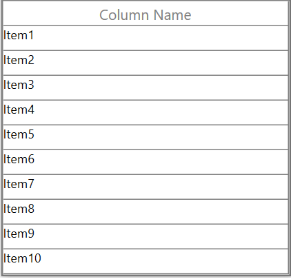

# How to Bind the List of String to WPF DataGrid?

This sample illustrates how to bind the list of string to [WPF DataGrid](https://www.syncfusion.com/wpf-controls/datagrid) (SfDataGrid).

`DataGrid` is bound to a collection with a class type. You can bind a list of string as an ItemsSource of `DataGrid` can be achieved by using [GridTemplateColumn](https://help.syncfusion.com/cr/wpf/Syncfusion.UI.Xaml.Grid.GridTemplateColumn.html).

```c#
public class ViewModel
{
    public ViewModel()
    {
        this.DataFieldList = new List<string>() { "Item1", "Item2" , "Item3", "Item4", "Item5", "Item6", "Item7", "Item8", "Item9", "Item10" };
    }

    public List<string> DataFieldList
    {
        get;
        set;
    }
}
```
```xml
<Window.DataContext>
    <local:ViewModel />
</Window.DataContext>
<Grid>
    <syncfusion:SfDataGrid Name="dataGrid"
                            AllowFiltering="False"
                            AllowResizingColumns="False"
                            AutoGenerateColumns="False"
                            ColumnSizer="Star"
                            NavigationMode="Row"
                            ItemsSource="{Binding DataFieldList, UpdateSourceTrigger=PropertyChanged}">
        <syncfusion:SfDataGrid.Columns>
            <syncfusion:GridTemplateColumn HeaderText="Column Name" >
                <syncfusion:GridTemplateColumn.CellTemplate>
                    <DataTemplate>
                        <TextBlock Text="{Binding}" />
                    </DataTemplate>
                </syncfusion:GridTemplateColumn.CellTemplate>
            </syncfusion:GridTemplateColumn>
        </syncfusion:SfDataGrid.Columns>
    </syncfusion:SfDataGrid>
</Grid>
```


